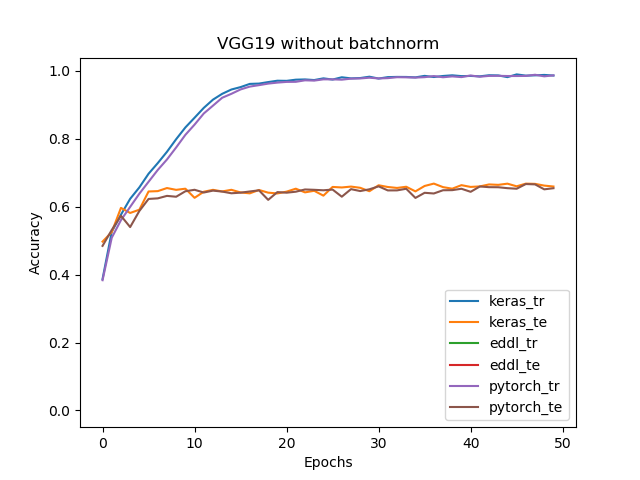
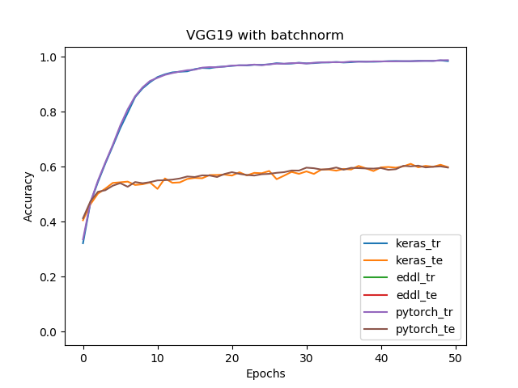
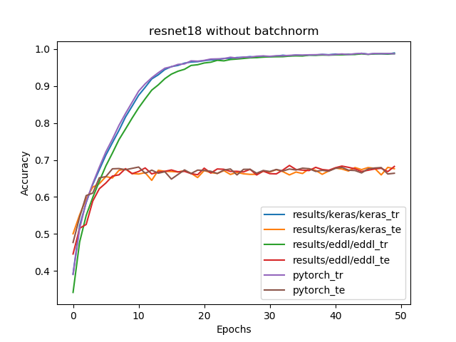
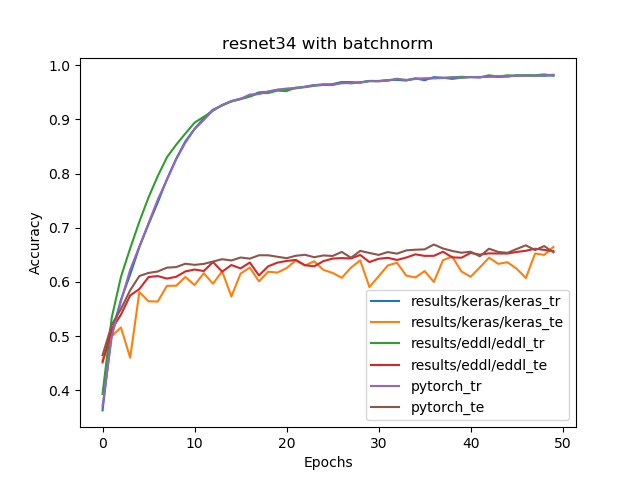
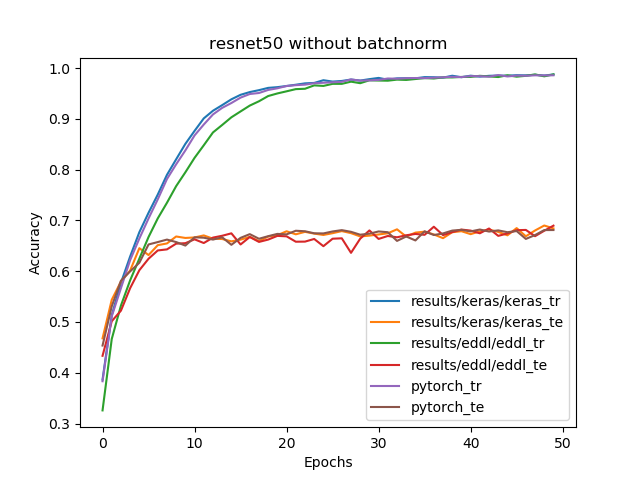

# Eddl benchmarks results
The results were obtained using the following configuration:
* EDDL version: 0.7.1
* Pytorch version: 1.6.0
* Keras version: 2.4.3
* Keras backend: tensorflow
* Tensorflow version: 2.2.0
* GPU model: Nvidia GeForce GTX 1050Ti
* CPU model: Intel(R) Core(TM) i7-7700HQ 2.80GHz
* Graphics and accuracy results obtained executing on GPU
## Cifar10
### VGGs
#### VGG16
|Without batchnorm|Keras|Pytorch|EDDL|PyEDDL|
|-----------------|----------|-----------|------|------|
|Train accuracy (%)|99.2|99.2|98.9|-|
|Test accuracy (%)|77.4|77.9|74.6|-|
|GPU Time per epoch (s)|67|77|146|147|
|CPU Time per epoch (s)|1932|887|3107|6966|

|With batchnorm|Keras|Pytorch|EDDL|PyEDDL|
|------------- | ---------- | ----------- |------|------|
|Train accuracy (%)|99.1|99.1|99.3|-|
|Test accuracy (%)|71.7|76.2|76.4|-|
|GPU Time per epoch (s)|72|81|204|204|
|CPU Time per epoch (s)|2028|956|2846|7962|

#### VGG19
|Without batchnorm*|Keras|Pytorch|EDDL|PyEDDL|
|------------- | ---------- | ----------- |------|------|
|Train accuracy (%)|98.7|98.7|98.9|-|
|Test accuracy (%)|66.0|65.5|68.2|-|
|GPU Time per epoch (s)|114|129|190|193|
|CPU Time per epoch (s)|2482|1262|3872|8992|

\* This experiment used HeUniform as weight initializer insted of GlorotUniform. GlorotUniform was the initializer for all the other experiments.

|With batchnorm|Keras|Pytorch|EDDL|PyEDDL|
|------------- | ---------- | ----------- |------|------|
|Train accuracy (%)|98.4|98.8|98.8|-|
|Test accuracy (%)|59.9|59.7|61.0|-|
|GPU Time per epoch (s)|120|135|260|264|
|CPU Time per epoch (s)|2679|1352|3838|8628|

### Resnets

#### Resnet18
|Without batchnorm|Keras|Pytorch|EDDL|PyEDDL|
|------------- | ---------- | ----------- |------|------|
|Train accuracy (%)|99.0|98.7|98.7|-|
|Test accuracy (%)|67.6|66.4|67.3|-|
|GPU Time per epoch (s)|40|62|36|37|
|CPU Time per epoch (s)|1534|456|932|1191|

|With batchnorm|Keras|Pytorch|EDDL|PyEDDL|
|------------- | ---------- | ----------- |------|------|
|Train accuracy (%)|98.7|98.5|98.4|-|
|Test accuracy (%)|64.0|65.7|64.8|-|
|GPU Time per epoch (s)|42|64|49|52|
|CPU Time per epoch (s)|1505|485|1207|1373|

#### Resnet34
|Without batchnorm|Keras|Pytorch|EDDL|PyEDDL|
|------------- | ---------- | ----------- |------|------|
|Train accuracy (%)|98.7|98.8|98.7|-|
|Test accuracy (%)|66.6|67.8|66.1|-|
|GPU Time per epoch (s)|73|103|65|67|
|CPU Time per epoch (s)|2554|834|1674|2073|

|With batchnorm|Keras|Pytorch|EDDL|PyEDDL|
|------------- | ---------- | ----------- |------|------|
|Train accuracy (%)|98.1|98.2|98.2|-|
|Test accuracy (%)|66.4|65.5|60.4|-|
|GPU Time per epoch (s)|76|107|89|93|
|CPU Time per epoch (s)|2600|895|2119|2301|

#### Resnet50
|Without batchnorm|Keras|Pytorch|EDDL|PyEDDL|
|------------- | ---------- | ----------- |------|------|
|Train accuracy (%)|98.7|98.6|98.7|-|
|Test accuracy (%)|68.4|68.1|66.4|-|
|GPU Time per epoch (s)|75|89|75|79|
|CPU Time per epoch (s)|2446|706|1684|2204|

|With batchnorm|Keras|Pytorch|EDDL|PyEDDL|
|------------- | ---------- | ----------- |------|------|
|Train accuracy (%)|97.1|97.1|97.6|-|
|Test accuracy (%)|61.3|63.1|61.9|-|
|GPU Time per epoch (s)|84|97|132|143|
|CPU Time per epoch (s)|2520|835|2622|2468|

### Plots

