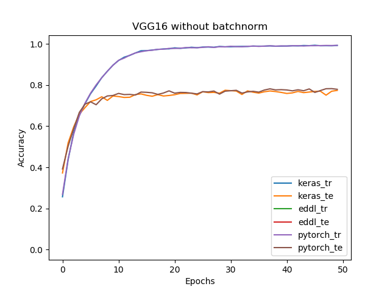
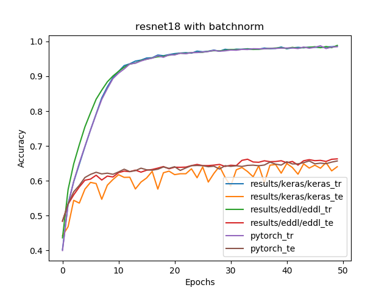

## New results with CUDNN8

The following results were obtained with CUDNN 8 and CUDA 10.2 to check the newest optimizations of eddl. The rest of them were obtained with an older version of CUDNN.
For these experiments, pytorch version is 1.7.1 and tensorflow version is 2.4.0 as these are the versions that support CUDNN8.

**Showing only GPU time per epoch**

## Cifar10
### VGGs
#### VGG16
|-----------------|----------|-----------|------|
|Experiment |Keras|Pytorch|EDDL|
|-----------------|----------|-----------|------|
|Without batchnorm|57|88|68|
|With batchnorm|64|93|73|

#### VGG19
|Without batchnorm*|Keras|Pytorch|EDDL|
|------------- | ---------- | ----------- |------|
|GPU Time per epoch (s)|104|137|115|

|With batchnorm|Keras|Pytorch|EDDL|
|------------- | ---------- | ----------- |------|
|GPU Time per epoch (s)|111|144|124|

### Resnets

#### Resnet18
|Without batchnorm|Keras|Pytorch|EDDL|
|------------- | ---------- | ----------- |------|
|GPU Time per epoch (s)|39|80|38|

|With batchnorm|Keras|Pytorch|EDDL|
|------------- | ---------- | ----------- |------|
|GPU Time per epoch (s)|40|82|40|

#### Resnet34
|Without batchnorm|Keras|Pytorch|EDDL|
|------------- | ---------- | ----------- |------|
|GPU Time per epoch (s)|65|138|65|

|With batchnorm|Keras|Pytorch|EDDL|
|------------- | ---------- | ----------- |------|
|GPU Time per epoch (s)|69|142|71|

#### Resnet50
|Without batchnorm|Keras|Pytorch|EDDL|
|------------- | ---------- | ----------- |------|
|GPU Time per epoch (s)|67|113|80|

|With batchnorm|Keras|Pytorch|EDDL|
|------------- | ---------- | ----------- |------|
|GPU Time per epoch (s)|76|122|93|

# Eddl benchmarks results
The results were obtained using the following configuration:
* EDDL version: 0.7.1
* Pytorch version: 1.6.0
* Keras version: 2.4.3
* Keras backend: tensorflow
* Tensorflow version: 2.2.0
* GPU model: Nvidia GeForce GTX 1050Ti
* CPU model: Intel(R) Core(TM) i7-7700HQ 2.80GHz
* Graphics and accuracy results obtained executing on GPU

## Cifar10
### VGGs
#### VGG16
|Without batchnorm|Keras|Pytorch|EDDL|PyEDDL|
|-----------------|----------|-----------|------|------|
|Train accuracy (%)|99.2|99.2|98.9|-|
|Test accuracy (%)|77.4|77.9|74.6|-|
|GPU Time per epoch (s)|62|72|146|146|
|CPU Time per epoch (s)|1313|887|3107|6950|

|With batchnorm|Keras|Pytorch|EDDL|PyEDDL|
|------------- | ---------- | ----------- |------|------|
|Train accuracy (%)|99.1|99.1|99.3|-|
|Test accuracy (%)|71.7|76.2|76.4|-|
|GPU Time per epoch (s)|68|77|204|204|
|CPU Time per epoch (s)|1375|956|2846|7062|

#### VGG19
|Without batchnorm*|Keras|Pytorch|EDDL|PyEDDL|
|------------- | ---------- | ----------- |------|------|
|Train accuracy (%)|98.7|98.7|98.9|-|
|Test accuracy (%)|66.0|65.5|68.2|-|
|GPU Time per epoch (s)|76|120|190|191|
|CPU Time per epoch (s)|1703|1262|3872|8137|

\* This experiment used HeUniform as weight initializer insted of GlorotUniform. GlorotUniform was the initializer for all the other experiments.

|With batchnorm|Keras|Pytorch|EDDL|PyEDDL|
|------------- | ---------- | ----------- |------|------|
|Train accuracy (%)|98.4|98.8|98.8|-|
|Test accuracy (%)|59.9|59.7|61.0|-|
|GPU Time per epoch (s)|81|126|260|260|
|CPU Time per epoch (s)|1809|1352|3838|8227|

### Resnets

#### Resnet18
|Without batchnorm|Keras|Pytorch|EDDL|PyEDDL|
|------------- | ---------- | ----------- |------|------|
|Train accuracy (%)|99.0|98.7|98.7|-|
|Test accuracy (%)|67.6|66.4|67.3|-|
|GPU Time per epoch (s)|25|59|36|36|
|CPU Time per epoch (s)|1234|456|932|1096|

|With batchnorm|Keras|Pytorch|EDDL|PyEDDL|
|------------- | ---------- | ----------- |------|------|
|Train accuracy (%)|98.7|98.5|98.4|-|
|Test accuracy (%)|64.0|65.7|64.8|-|
|GPU Time per epoch (s)|26|60|49|50|
|CPU Time per epoch (s)|1244|485|1207|1234|

#### Resnet34
|Without batchnorm|Keras|Pytorch|EDDL|PyEDDL|
|------------- | ---------- | ----------- |------|------|
|Train accuracy (%)|98.7|98.8|98.7|-|
|Test accuracy (%)|66.6|67.8|66.1|-|
|GPU Time per epoch (s)|44|97|65|65|
|CPU Time per epoch (s)|2125|834|1674|1829|

|With batchnorm|Keras|Pytorch|EDDL|PyEDDL|
|------------- | ---------- | ----------- |------|------|
|Train accuracy (%)|98.1|98.2|98.2|-|
|Test accuracy (%)|66.4|65.5|60.4|-|
|GPU Time per epoch (s)|46|101|89|91|
|CPU Time per epoch (s)|2140|895|2119|2023|

#### Resnet50
|Without batchnorm|Keras|Pytorch|EDDL|PyEDDL|
|------------- | ---------- | ----------- |------|------|
|Train accuracy (%)|98.7|98.6|98.7|-|
|Test accuracy (%)|68.4|68.1|66.4|-|
|GPU Time per epoch (s)|47|84|75|77|
|CPU Time per epoch (s)|1995|706|1684|1843|

|With batchnorm|Keras|Pytorch|EDDL|PyEDDL|
|------------- | ---------- | ----------- |------|------|
|Train accuracy (%)|97.1|97.1|97.6|-|
|Test accuracy (%)|61.3|63.1|61.9|-|
|GPU Time per epoch (s)|52|92|132|135|
|CPU Time per epoch (s)|2044|835|2622|2074|

## Detected anomalies
### Time
* PyEDDL usually lasts a bit more than EDDL. However, with VGGs in CPU, that increase is abnormaly huge (more than double).
* In Resnet50 with batchnorm in CPU PyEDDL lasts less than EDDL. This may be circumstantial as it was tested only in one epoch.
* The time increase due to BatchNorm is much greater in EDDL than in Keras or Pytorch.
* EDDL times are quite competitive in Resnets but much worse than Keras and Pytorch in VGGs.
* EDDL and PyEDDL last more with batchnorm than without it in CPU with VGGs.
* EDDL in CPU, Resnet34 and Resnet50 without batchnorm have almost the same time. But the same networks with batchnorm present a huge difference. PyEDDL is more consistent and shows almost no difference in time between Resnet34 and Resnet50 without batchnorm and between Resnet34 and Resnet50 with it. That makes Resnet50 with batchnorm much slower in EDDL than in PyEDDL.

### Accuracy
* EDDL converges slower than Keras and Pytorch without batchnorm, specially in VGGs.
* With VGG16, it doesn't reach the same accuracy as Keras and Pytorch. With VGG19 it didn't reach it neither, but using HeUniform instead of GlorotUniform as initializer seemed to solve the problem.
* In general, Pytorch's test accuracy is more stable and a bit higher than Keras and EDDL when using batchnorm.

### Plots

