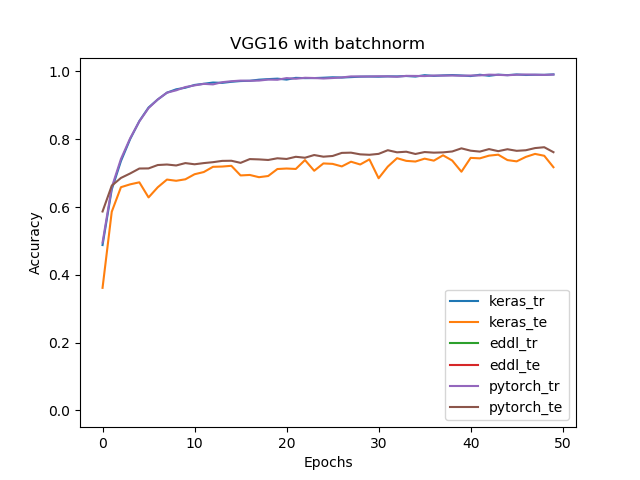
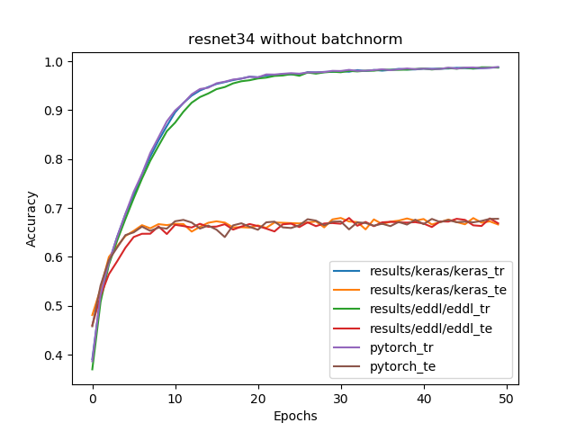

# Eddl benchmarks results
The results were obtained using the following configuration:
* EDDL version: 0.7.1
* Pytorch version: 1.6.0
* Keras version: 2.4.3
* Keras backend: tensorflow
* Tensorflow version: 2.2.0
* Executed on: GPU Nvidia GeForce GTX 1050Ti
## Cifar10
### VGGs
#### VGG16
|Without batchnorm|Keras|Pytorch|EDDL|
|-----------------|----------|-----------|------|
|Train accuracy (%)|99.2|99.2|98.9|
|Test accuracy (%)|77.4|77.9|74.6|
|Time per epoch (s)|67|77|146|

|With batchnorm|Keras|Pytorch|EDDL|
|------------- | ---------- | ----------- |------|
|Train accuracy (%)|99.1|99.1|99.3|
|Test accuracy (%)|71.7|76.2|76.4|
|Time per epoch (s)|72|81|204|

#### VGG19
|Without batchnorm*|Keras|Pytorch|EDDL|
|------------- | ---------- |----------- |------|
|Train accuracy (%)|98.7|98.7|98.9|
|Test accuracy (%)|66.0|65.5|68.2|
|Time per epoch (s)|114|129|190|

\* Este experimento se hizo con HeUniform como inicializador en lugar de GlorotUniform, que es el que se usó en los demás

|With batchnorm|Keras|Pytorch|EDDL|
|------------- | ---------- | ----------- |------|
|Train accuracy (%)|98.4|98.8|98.8|
|Test accuracy (%)|59.9|59.7|61.0|
|Time per epoch (s)|120|135|260|

### Resnets

#### Resnet18
|Without batchnorm|Keras|Pytorch|EDDL|
|------------- | ---------- | ----------- |------|
|Train accuracy (%)|99.0|98.7|98.7|
|Test accuracy (%)|67.6|66.4|67.3|
|Time per epoch (s)|40|62|36|

|With batchnorm|Keras|Pytorch|EDDL|
|------------- | ---------- | ----------- |------|
|Train accuracy (%)|98.7|98.5|98.4|
|Test accuracy (%)|64.0|65.7|64.8|
|Time per epoch (s)|42|64|49|

#### Resnet34
|Without batchnorm|Keras|Pytorch|EDDL|
|------------- | ---------- | ----------- |------|
|Train accuracy (%)|98.7|98.8|98.7|
|Test accuracy (%)|66.6|67.8|66.1|
|Time per epoch (s)|73|103|65|

|With batchnorm|Keras|Pytorch|EDDL|
|------------- | ---------- | ----------- |------|
|Train accuracy (%)|98.1|98.2|98.2|
|Test accuracy (%)|66.4|65.5|60.4|
|Time per epoch (s)|76|107|89|

#### Resnet50
|Without batchnorm|Keras|Pytorch|EDDL|
|------------- | ---------- | ----------- |------|
|Train accuracy (%)|98.7|98.6|98.7|
|Test accuracy (%)|68.4|68.1|66.4|
|Time per epoch (s)|75|89|75|

|With batchnorm|Keras|Pytorch|EDDL|
|------------- | ---------- | ----------- |------|
|Train accuracy (%)|97.1|97.1|97.6|
|Test accuracy (%)|61.3|63.1|61.9|
|Time per epoch (s)|84|97|132|

